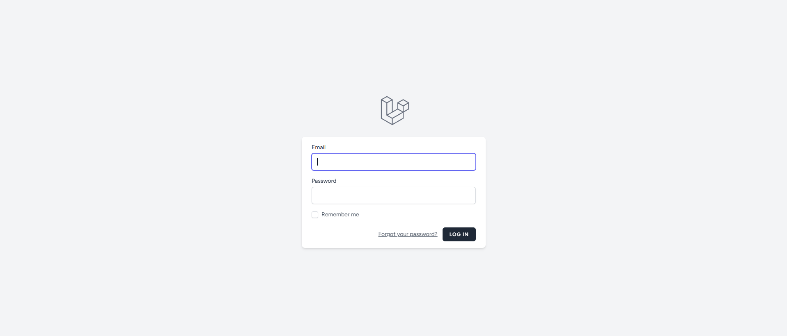
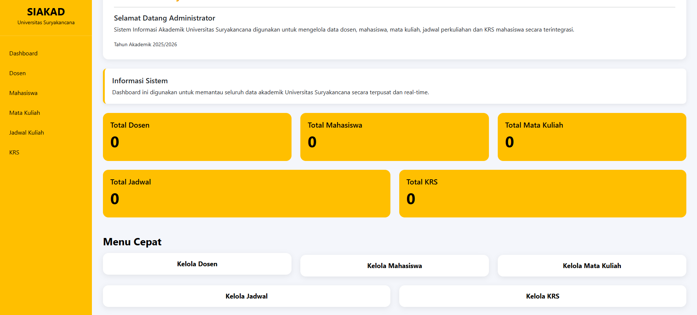
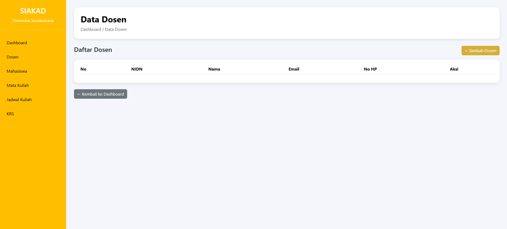
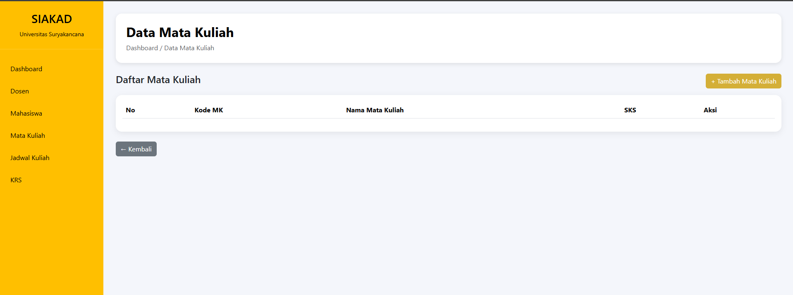
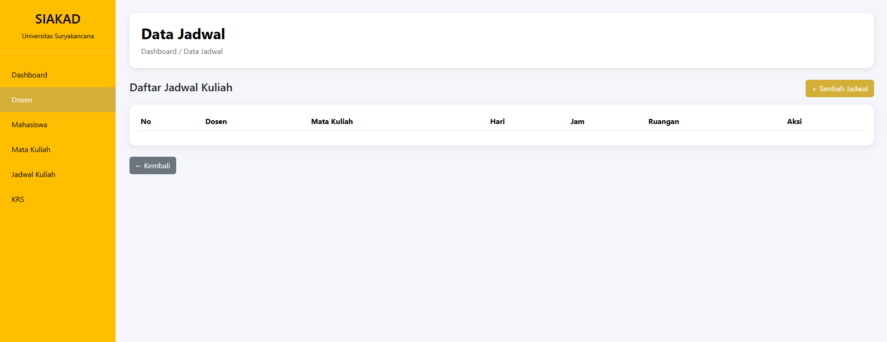
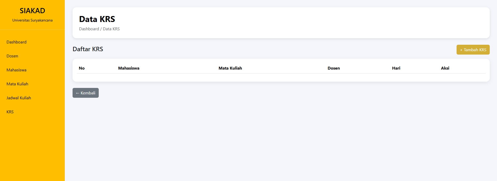

## Demo Aplikasi

### Link Hosting

Aplikasi dapat diakses melalui :

https://amanda.ifalgorithm24.web.id/

### Akun Login Admin (Dosen)

Email :

admin@gmail.com

Password :

password

### Akun Login Mahasiswa

Email :

mahasiswa@gmail.com

Password :

password

## Akun Login

### Admin

Email :

admin@gmail.com

Password :

password

### Mahasiswa

Email :

mahasiswa@gmail.com

Password :

password

# Sistem Informasi Akademik (SIAKAD)

## Deskripsi

Sistem Informasi Akademik (SIAKAD) berbasis Laravel yang digunakan untuk mengelola data akademik kampus.

Aplikasi memiliki dua hak akses:

### Admin (Dosen)

Admin dapat:

- Mengelola Data Dosen
- Mengelola Data Mahasiswa
- Mengelola Data Mata Kuliah
- Mengelola Data Jadwal Kuliah
- Mengelola Data KRS
- Menambah, mengubah, dan menghapus data

### Mahasiswa

Mahasiswa dapat:

- Melihat Data Mata Kuliah
- Melihat Jadwal Kuliah
- Melihat Data KRS
- Tidak dapat menambah, mengubah, maupun menghapus data

---

## Teknologi yang Digunakan

- Laravel 12
- PHP 8
- MySQL
- Bootstrap 5
- Breeze Authentication
- Git & GitHub

---

## Fitur Sistem

### Login Multi Role

- Admin (Dosen)
- Mahasiswa

### Admin

- CRUD Dosen
- CRUD Mahasiswa
- CRUD Mata Kuliah
- CRUD Jadwal Kuliah
- CRUD KRS

### Mahasiswa

- Lihat Mata Kuliah
- Lihat Jadwal
- Lihat KRS

---

## Akun Login

### Admin

Email:

```text
admin@gmail.com
```

Password:

```text
password
```

### Mahasiswa

Email:

```text
mahasiswa@gmail.com
```

Password:

```text
password
```

---

# Dokumentasi Tampilan

## Login Admin



---

## Dashboard Admin



---

## Data Dosen



---

## Data Mata Kuliah (Admin)



---

## Data Jadwal (Admin)



---

## Data KRS (Admin)



---

## Dashborad Mahasiswa


---

## Struktur Database

Tabel yang digunakan:

- users
- dosens
- mahasiswas
- mata_kuliahs
- jadwals
- krs

---

## Author

Kamil Rizki Kusuma

Universitas Suryakancana

Mata Kuliah Pemrograman Web Lanjut
